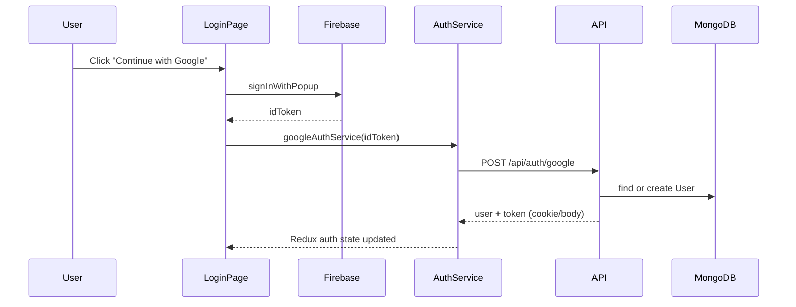

# Architecture

## Overview

Cosmic UI is organized as a **monorepo** with three main packages and shared root tooling. The product vision is: users sign in with Google, receive AI credits, and generate UI components using a cohesive design system and component library.

```
┌─────────────────────────────────────────────────────────────────┐
│                         Cosmic UI Monorepo                       │
├─────────────┬─────────────────────┬─────────────────────────────┤
│   client/   │      server/        │         library/            │
│  React SPA  │   Express REST API  │  cosmic-ui-library (npm)    │
│  Vite dev   │   MongoDB + JWT     │  Button, Card, ProfileCard  │
└──────┬──────┴──────────┬──────────┴──────────────┬──────────────┘
       │                 │                           │
       │    HTTP/JSON    │                           │
       └────────────────►│                           │
       │  Firebase Auth  │                           │
       └────────────────►│ (Google idToken → API)    │
                         │                           │
                         ▼                           ▼
                    MongoDB Users              Consumed by apps
```

## Package responsibilities

### `client/` — Frontend application

- **Entry:** `client/src/main.jsx`
- **State:** Redux Toolkit (`app/app.store.js`) — auth slice only today
- **Routing:** React Router — `/` → `LoginPage`, catch-all → redirect `/`
- **Styling:** Tailwind CSS v4 via `@import "tailwindcss"` and `@theme` tokens in `app/index.css`
- **Auth UI:** `features/auth/` — login page, hooks, services, Redux slice
- **Motion:** Framer Motion on login steps carousel

`App.jsx` initializes auth from localStorage but is **not** wired in `main.jsx` yet; routing is defined directly in `main.jsx`.

### `server/` — Backend API

- **Entry:** `server/index.js`
- **Routes:** `/api/auth/*` → `routes/auth.routes.js`
- **Persistence:** Mongoose `User` model
- **Auth:** JWT in **httpOnly cookie** (`token`), 7-day expiry
- **DB:** `config/connectDB.js` connects on server listen

### `library/` — UI component package

- **Package name:** `cosmic-ui-library`
- **Build:** tsup → `dist/index.js` (CJS) + `dist/index.mjs` (ESM)
- **Exports:** `Button`, `Card`, `ProfileCard`
- **Peer dependency:** `react >= 18`

### Root — Shared dev experience

- ESLint 9 flat config (`eslint.config.js`)
- Prettier + Tailwind plugin
- Husky: pre-commit (lint-staged), commit-msg (conventional commits)

## Authentication data flow (intended)



See [Authentication](./authentication.md) for current implementation gaps between client and server.

## User model (server)

Users are stored with:

| Field        | Type   | Default          | Notes                    |
| ------------ | ------ | ---------------- | ------------------------ |
| `name`       | String | required         | Display name             |
| `email`      | String | required, unique | From Google              |
| `role`       | String | `"user"`         | Enum: `user`, `admin`    |
| `aiCredit`   | Number | `150`            | Shown on login UI        |
| `timestamps` | auto   | —                | `createdAt`, `updatedAt` |

## Client feature layout

```
client/src/
├── app/
│   ├── App.jsx           # Auth init + layout shell (not used by main.jsx yet)
│   ├── app.store.js      # Redux store
│   ├── app.routes.js     # Route config (not wired in main.jsx)
│   └── index.css         # Design tokens + Tailwind theme
├── features/
│   └── auth/             # Auth feature module
├── utils/
│   ├── firebase.js       # Firebase app + Google provider
│   ├── storage.js        # localStorage helper
│   ├── errorHandler.js   # API error utilities
│   └── useForm.js        # Form state hook
├── Design/
│   └── design.md         # Full design system spec
└── main.jsx              # App bootstrap
```

## Design system integration

Tokens live in `client/src/app/index.css` as CSS custom properties and Tailwind `@theme` entries (e.g. `--color-warm-accent`, `--spacing-md`). The login page uses Tailwind utility classes mapped to those tokens (`bg-soft-cream`, `text-charcoal`, `font-sora`).

The **library** components use inline styles and default props rather than the Cosmic token CSS — they are generic/styled independently today.

## Deployment considerations (not configured in repo)

- **Client:** static build via `npm run build` → `client/dist`
- **Server:** Node process; set `secure: true` on cookies in production
- **Library:** publish `dist/` to npm; `files` field limits package contents
- **Secrets:** never commit `.env` / `.env.local`

## Future extension points

Documented in `client/SETUP_COMPLETE.md` but not yet in code:

- Protected `/dashboard` route
- Shared `App.jsx` + `app.routes.js` wiring
- More Redux slices (components, credits, generation)
- Library components aligned with design tokens
